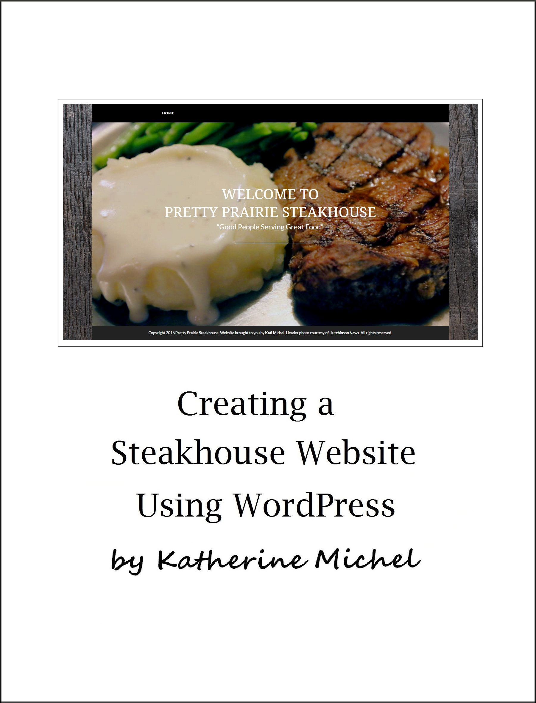

# Creating a Steakhouse Website Using WordPress

A GitBook Documenting My Experience of Creating a Steakhouse Website Using WordPress

Table of Contents
* [About](README.md)
* [Introduction](introduction.md)
* [WordPress](wordpress/wordpress.md)
  * [WordPress Admin Dashboard](wordpress/wordpress-admin-dashboard.md)
* [Deployment](deployment.md)
* [Design](design/design.md)
  * [Wireframes](design/wireframes.md)
  * [Color Scheme](design/color-scheme.md)
  * [Backgrounds and Textures](design/backgrounds-and-textures.md)
  * [Page Templates](design/page-templates.md)
  * [Detail Page Layout Variations](design/detail-page-layout-variations.md)
  * [Header Photo Shopping](design/header-photo-shopping.md)
  * [High Fidelity Homepage Prototype](design/high-fidelity-homepage-prototype.md)
  * [Homepage Mockup Design Variations](design/homepage-mockup-design-variations.md)
  * [Navbar Mockup](design/navbar-mockup.md)
* [Detail Page Content](design/detail-page-content.md)
  * [Preliminary Restaurant Photos](preliminary-restaurant-photos/preliminary-restaurant-photos.md)
  * [Restaurant Menu](restaurant-menu/restaurant-menu.md)
  * [Potter Creek Outfitters](potter-creek-outfitters/potter-creek-outfitters.md)
  * [Local Partners](local-partners/local-partners.md)
* [Secondary Functionality](design/secondary-functionality.md)
* [Finished Website](finished-website/finished-website.md)

* [User Research](user-research/user-research.md)
  * [Google Form](user-research/google-form.md) 
  * [Personas](user-research/personas.md) 
* [Promotion](promotion/promotion.md)
  * [Flemings Promotion Lightning Demo](promotion/flemings-promotion-lightning-demo.md)
  * [Facebook Profile](promotion/facebook-profile.md)
* [Brand Fun](brand-fun.md)
* [Client Consultation and Feedback](client-consultation-and-input.md)
* [Lessons Learned](lessons-learned.md)

GitBook: http://www.gitbook.com/book/katherinemichel/creating-a-steakhouse-website-using-wordpress/
  
GitHub repo: https://github.com/KatherineMichel/creating-a-steakhouse-website-using-wordpress

© [Katherine Michel](http://katherinemichel.github.io) 2016

