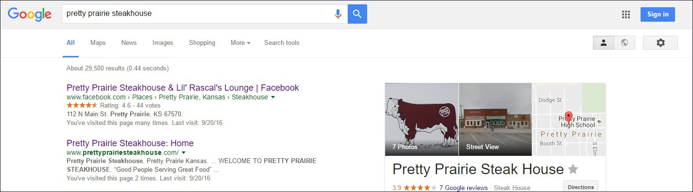
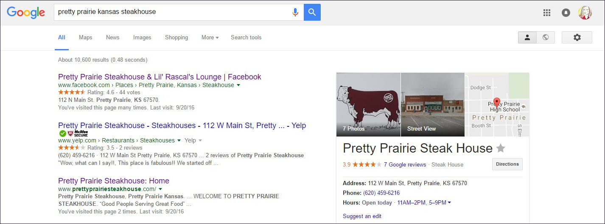
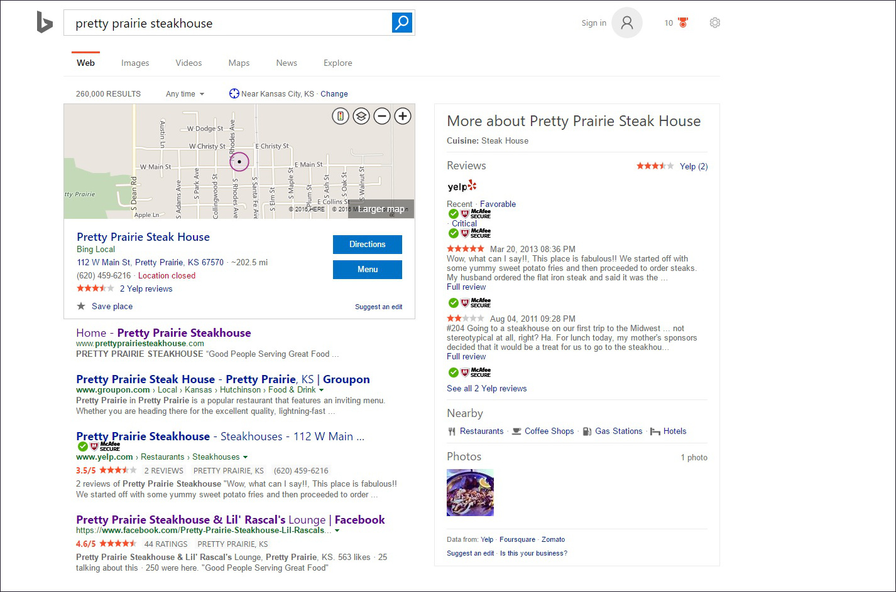
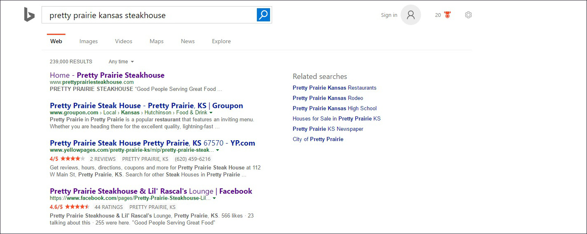
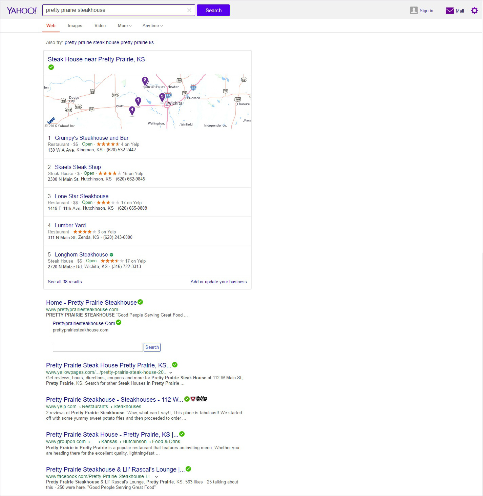
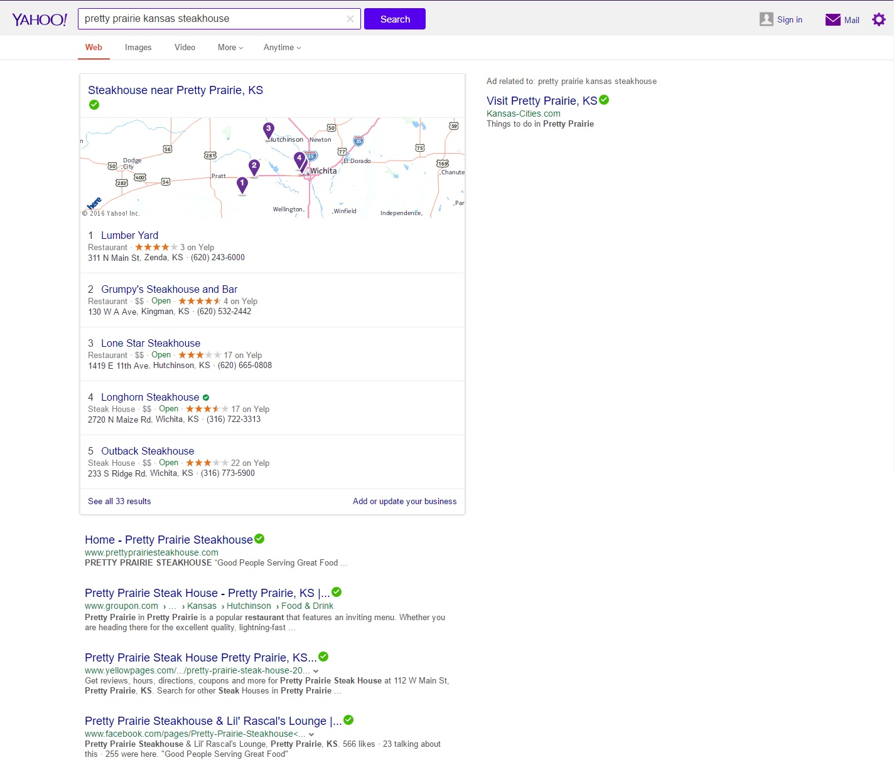

# Search Engine Optimization (SEO) 

The website (with and without www) was submitted to all three major search engines (Google, Bing, and Yahoo). I did not want to promote the website until it was displayed in the the search results of all three major search engines, because I wanted the clicks of people checking out the website for the first time to be recorded and help to raise the ranking in local and non-local searches. Search Engine Optimization can also be improved through good keywords and content.

## Goals

The initial goal is for the steakhouse website to be a top ranking for the searches "pretty prairie steakhouse" and "pretty prairie kansas steakhouse". The next goal is for the steakhouse website to be highly ranked for regional searches ("hutchinson steakhouse", "kingman steakhouse", "wichita steakhouse"). And of course, it would be advantageous for the steakhouse to be ranked in more general searches, such as "kansas steakhouse".  

In addition, Search Engine Optimization tools should be used to optimize website link sharing on Facebook.

## Google

Google has more traffic and took longer to display the website as a search result. Presumably due to clicks from the initial launch of the website, the website very quickly rose from being listed at the bottom of the first page of the Google search results, to being the search result second-from-the-top, just beneath the steakhouse Facebook page that has been in existence for years. 

Google search "pretty prairie steakhouse": Facebook page first result, website second result

Google search "pretty prairie kansas steakhouse": Facebook page first result, website third result

## Bing

The website was immediately the top result in Bing. 

Bing search "pretty prairie steakhouse": website first result, Facebook page fourth result

Bing search "pretty prairie kansas steakhouse": website first result, Facebook page fourth result

## Yahoo

The website was immediately the top result in Yahoo.

Yahoo search "pretty prairie steakhouse": website first result, Facebook page fifth result

Yahoo search "pretty prairie kansas steakhouse": website first result, Facebook page fourth result

