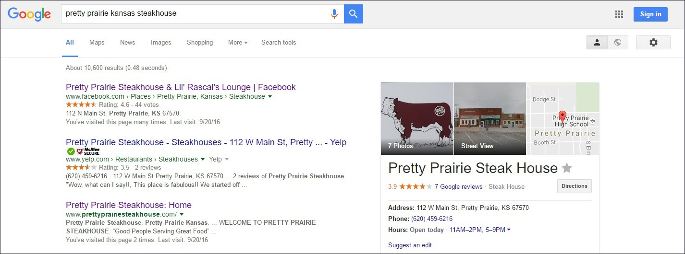
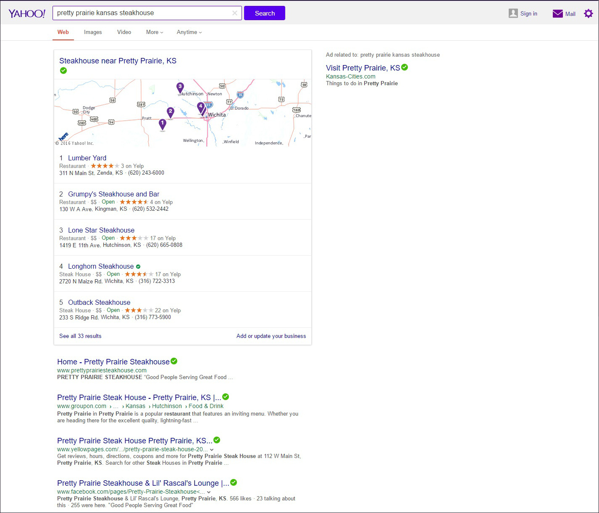

# Search Engine Optimization (SEO) 

The website (with and without www) was submitted to all three major search engines (Google, Bing, and Yahoo). I did not want to promote the website until it was displayed in the the search results of all three major search engines, because I wanted the clicks of people checking out the website for the first time to be recorded and help to raise the ranking in local and non-local searches. Search Engine Optimization can also be improved through good keywords and content.

## Goals

The steakhouse can aspire to be ranked more highly for more general searches, such as "Kansas steakhouse"

Facebook

## Google

Google has more traffic and took longer to display the website as a search result. Presumably due to clicks from the initial launch of the website, the website very quickly rose from being listed at the bottom of the first page of the Google search results, to being the search result second-from-the-top, just beneath the steakhouse Facebook page that has been in existence for years. 

## Yahoo and Bing

For a search of "Pretty Prairie Kansas steakhouse," the website was immediately the top result in Bing and Yahoo. 

