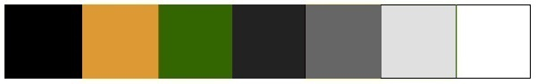

# Color Scheme

## Colors

Black (#000000), golden-brown (#dd9933), green (#336601), white (#ffffff)

## Black Color Theme

The black color theme features a black navbar and gray footer. Text is white, brown on hover.

Navbar

Navbar with mouse hovering over hyperlink

Footer (placeholder)

Footer with mouse hovering over hyperlink (placeholder)

## White Color Theme

The white color theme features a white navbar and white footer. Text is black, brown on hover.

Navbar

Navbar with mouse hovering over hyperlink

Footer (placeholder)

Footer with mouse hovering over hyperlink (placeholder)

## Favicon

