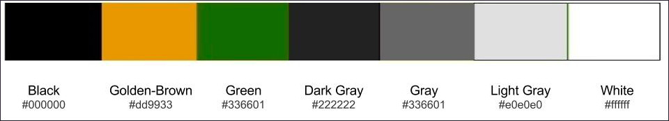

# Color Scheme

## Colors

Black (#000000), golden-brown (#dd9933), green (#336601), dark gray (#222222), gray (#666666), light gray (#e0e0e0), white (#ffffff)

## Black Color Theme

The black color theme features a black (#000000) navbar with white (#ffffff) text, golden-brown (#dd9933) on hover, and dark gray (#222222) footer with light gray (#e0e0e0) text, with hyperlinks that are white (#ffffff), golden-brown (#dd9933) on hover.

Navbar

Navbar with mouse hovering over hyperlink

Footer

Footer with mouse hovering over hyperlink

## White Color Theme

The white color theme features a white (#ffffff) navbar and footer. Text is gray (#666666), golden-brown (#dd9933) on hover.

Navbar

Navbar with mouse hovering over hyperlink

Footer

Footer with mouse hovering over hyperlink

## Favicon

