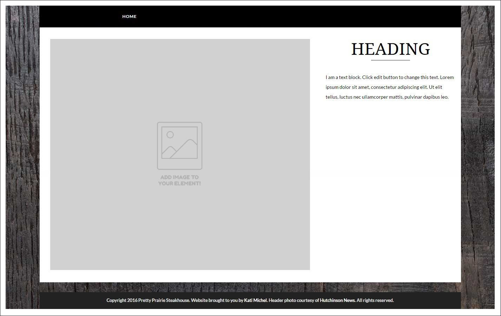
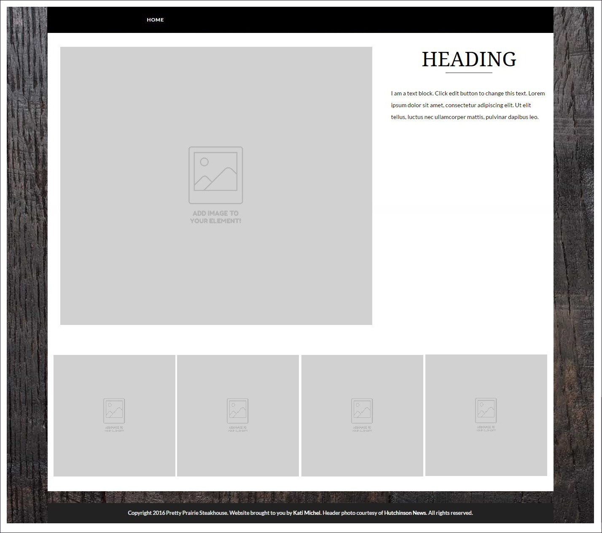
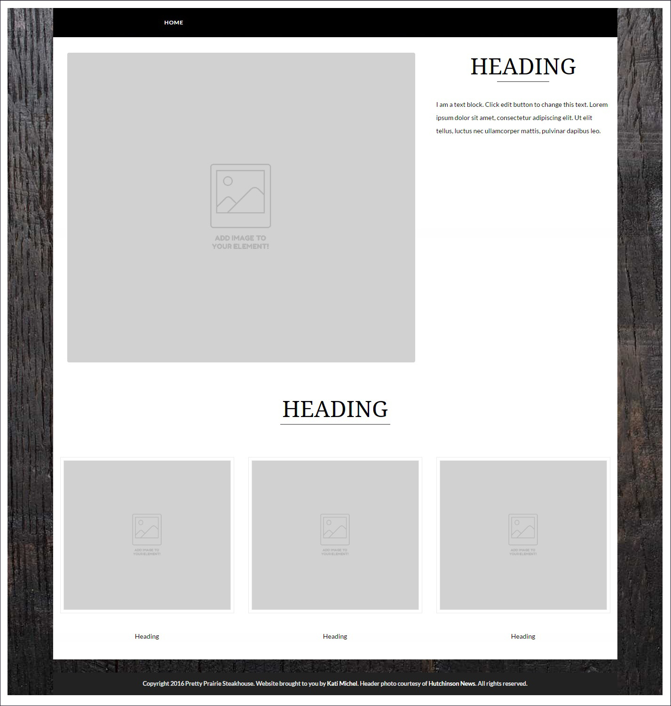
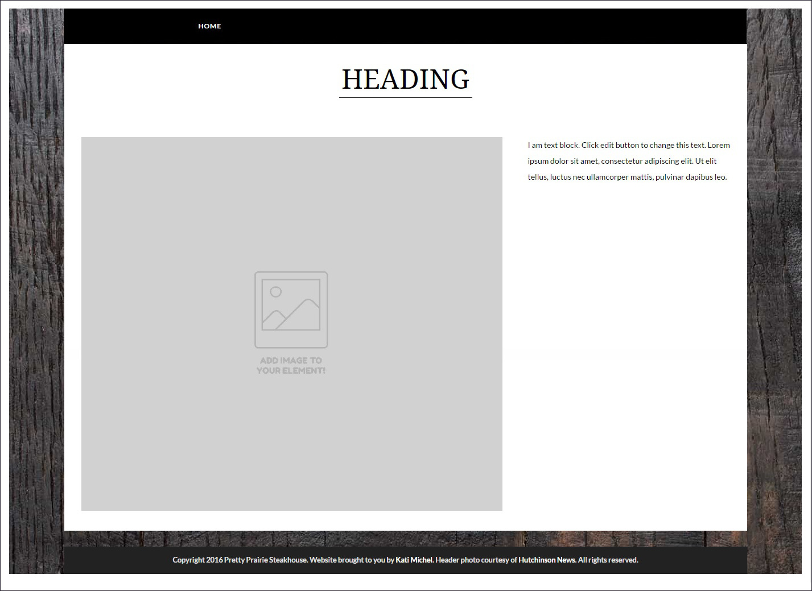
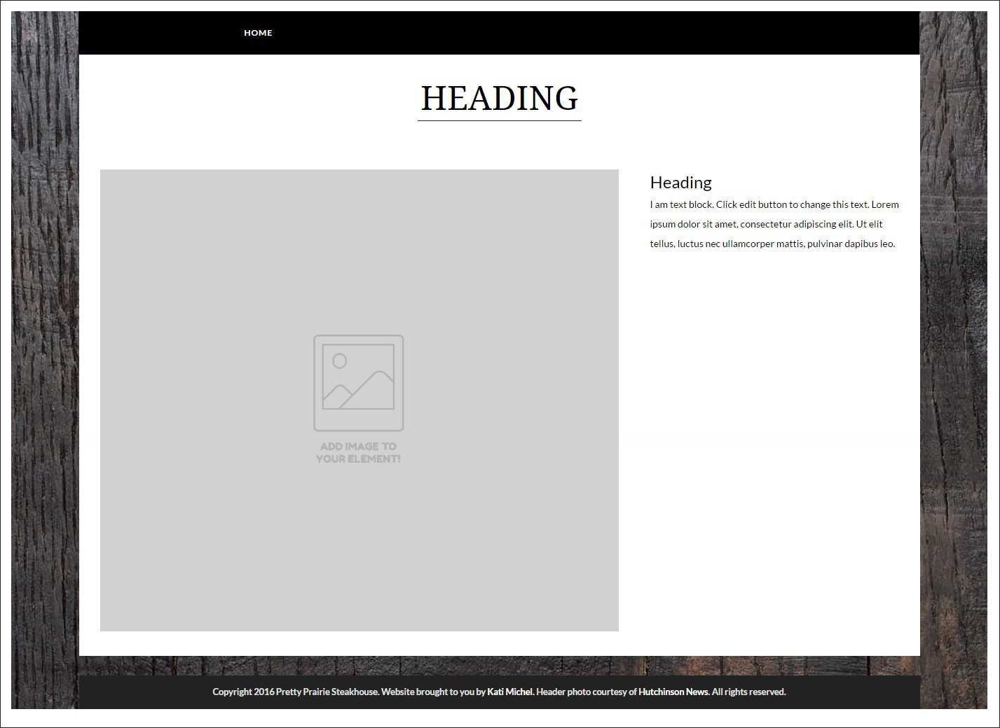
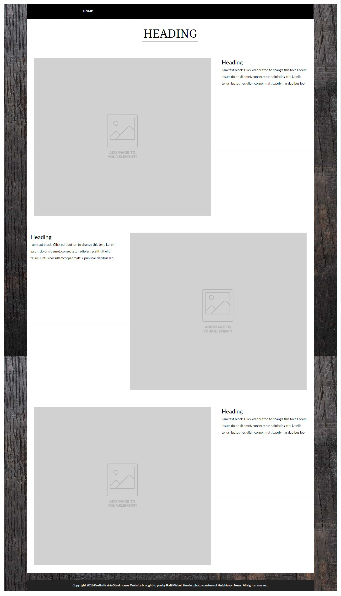
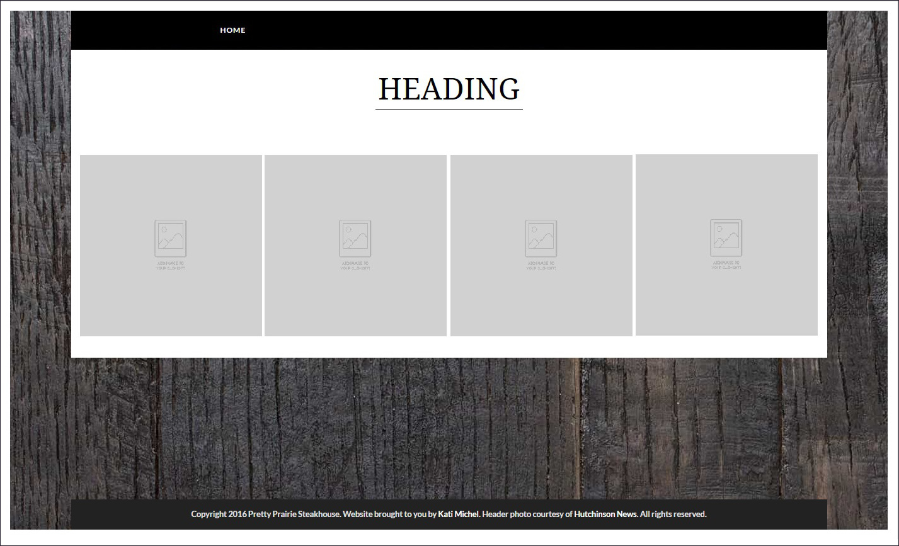

# Detail Page Layout Variations

## Feature Section

On the left, full picture (no outline); on the right, custom heading, separator, and text block

Feature, with gallery below; four pictures to a row

Feature, with feature gallery below; three pictures to a row, with outline around each picture, heading for each picture

## Collection or List Section

Custom heading and separator at the top-center of section

### Gallery

