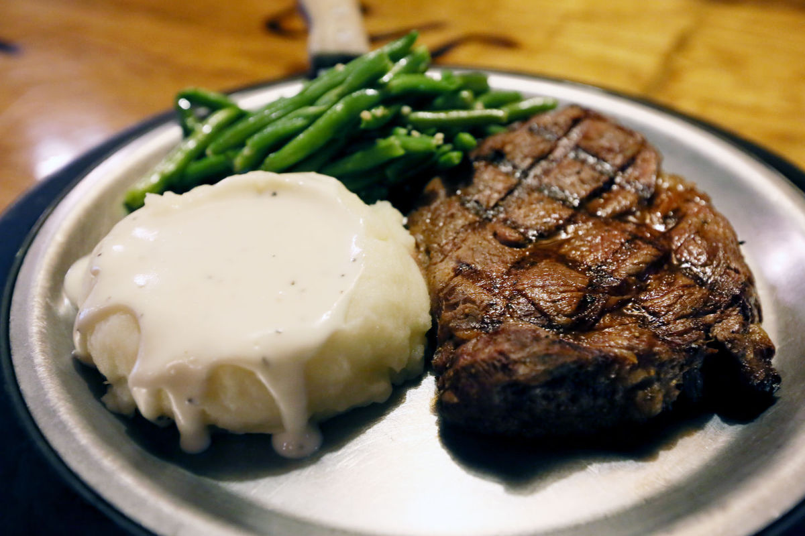
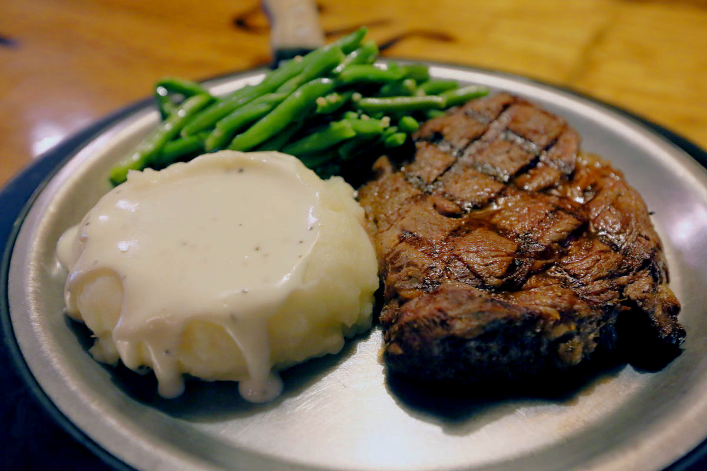
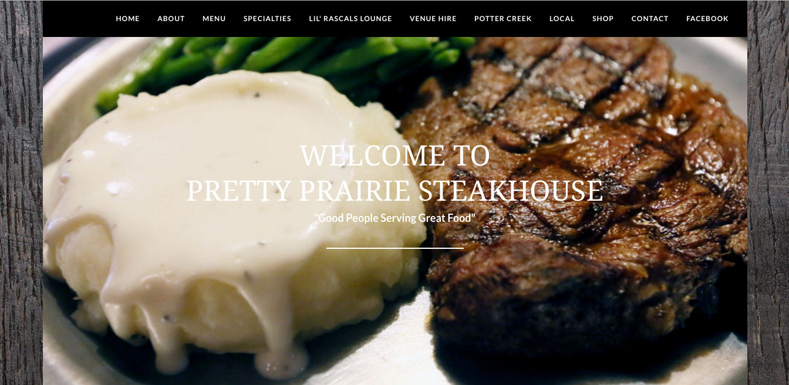
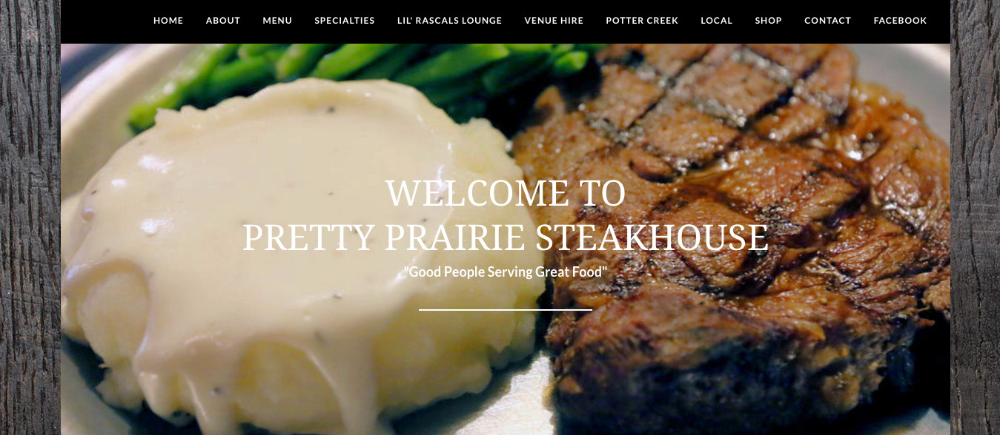

# Header Photo Shopping

The header photo, which is used with permission of the [Hutchinson News](http://www.hutchnews.com), was taken from a [Hutchinson News story](http://www.hutchnews.com/projects/progress/progress-a-small-town-s-prairie-survival-rodeo-just-part/article_3d11eaba-435c-5be2-8716-47b73a5e7558.html) about the Pretty Prairie Steakhouse. The photo is of a quintessential Pretty Prairie Steakhouse dinner of ribeye with mashed potatoes, gravy and green beans. 

Using a free, open source photo editing program called [Gimp](https://www.gimp.org), I "photo shopped" the original header photo in order to increase the contrast. The difference is subtle, but makes the white header text easier to read over the mashed potatoes and gravy.

Note: the image was compressed before use in production

## Original Header Photo

## Photo Shopped Header Photo

## Header Before

## Header After

