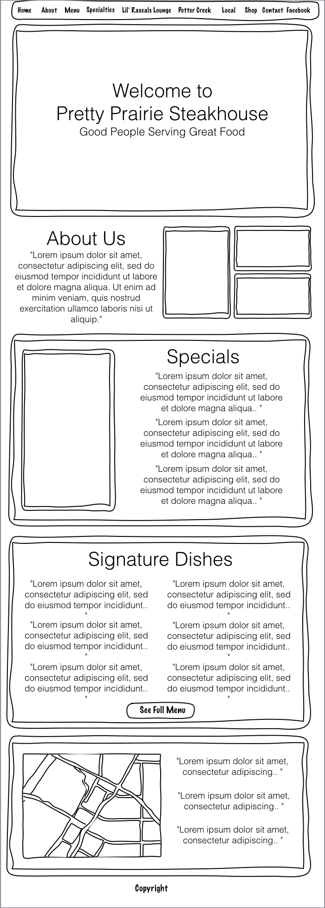
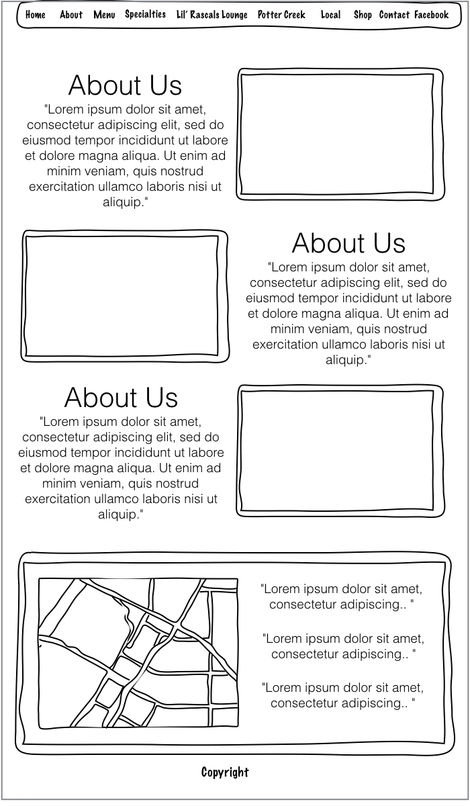

# Wireframes

While mobile testing an early version of the website, the homepage was slow to load on an iPhone 4. I decided to keep the homepage short (rather than long as in the wireframe below) to reduce loading time. 

Wireframes made using [Keynote](http://www.apple.com/mac/keynote) and [Keynotopia](http://keynotopia.com) prototyping software 

## Homepage

## Detail Page

Example: About Us

