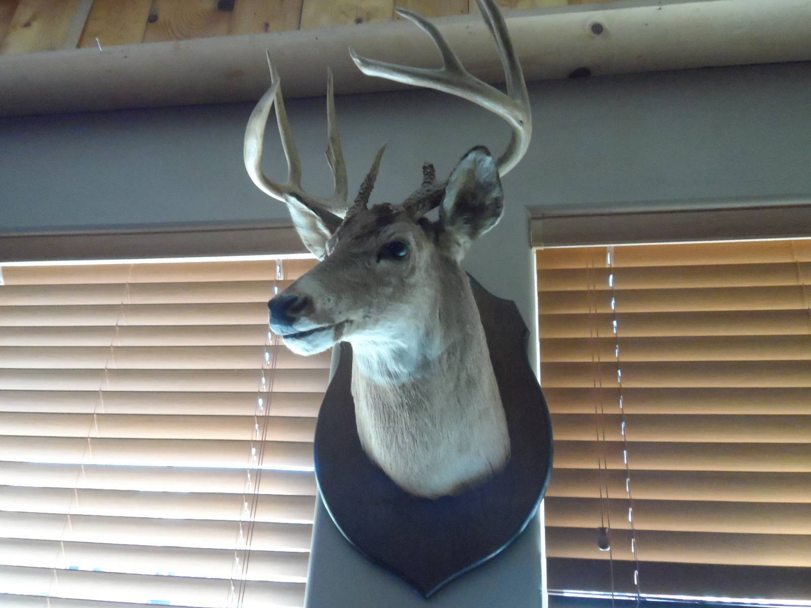

# Introduction

A client asked me to design and set up a professional-looking restaurant website in a very short amount of time, including a dashboard that non-techies could use. As part of this project, I would provide client consultation, strategic recommendations, requirements capture, wireframe and mockup creation, website design and deployment (hardware and software), admin training, and user feedback collection. 

Pretty Prairie Steakhouse

Pretty Prairie Steakhouse- Lil' Rascals Lounge

Keeping an Eye on the Restaurant

