# Flemings Promotion Lightning Demo

The client asked me to do an analysis of the Fleming's Steakhouse chain website, because the client is a customer of Fleming's Steakhouse and feels their website promotes their products and services well. 

The Flemings website has a pretty nice look to it. The design and content are sophisticated. The colors are bright and mostly attractive, and the layout is nice. The photo quality is a highlight. The full-screen product photos are excellent. One thing that sets this website is apart is promotion. The promotion is well done, starting with an information bar at the top under the navigation bar, a slide-in panel on the right for making reservations, and product call outs with full-screen photo carousels as backgrounds. The site engages well with customers, offering special deals such as gift cards and Friend of Fleming's sign up, and an opportunity to give feedback through a guest survey. 

My main quibble design wise is that the color scheme includes both fuschia and red (slide-in-panel, navigation bar link hover), and these are not "complimentary" colors. I feel the two colors are two close on the color wheel and clash as a result. Admittedly, this is a bit nit-picky and I'm sure there are others out there who would have a different opinion. Also, the wood paneling has a bit of a faux look about it, but is ok.

Targeted Ad
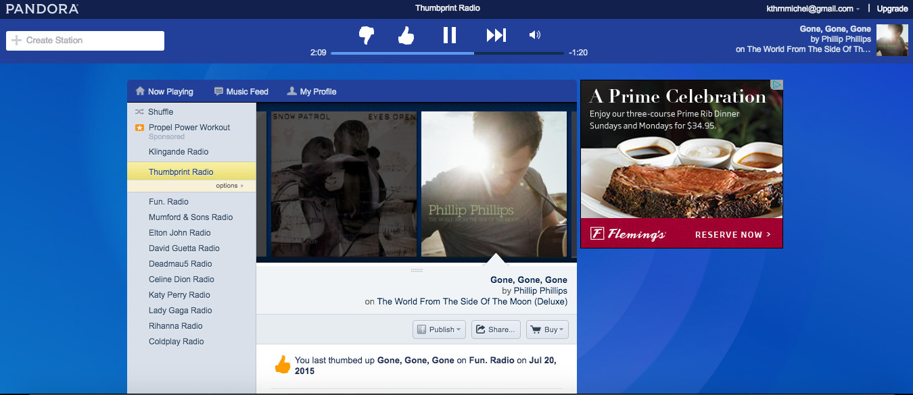

Geolocation (Placeholder)

Reservations Slide-In Panel
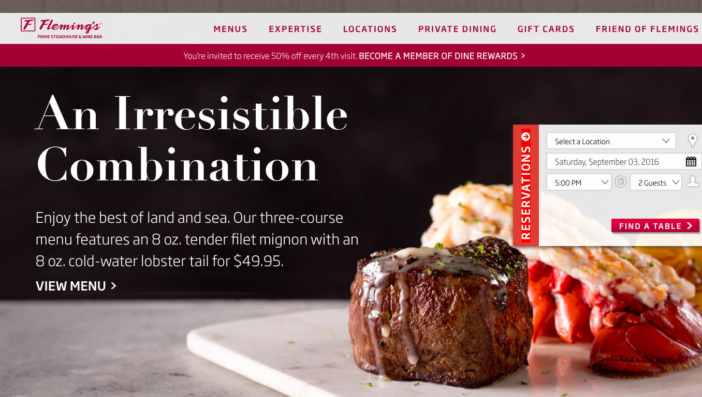

Home with Advertisements
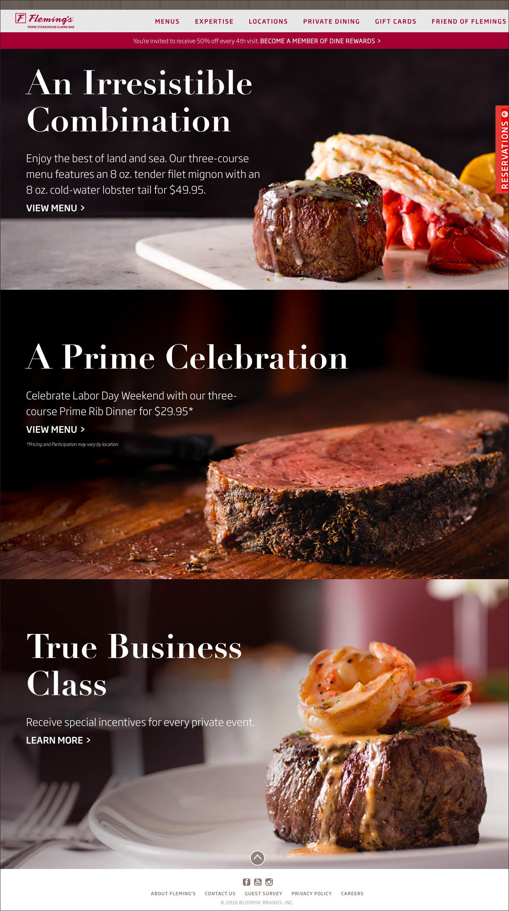

Expertise
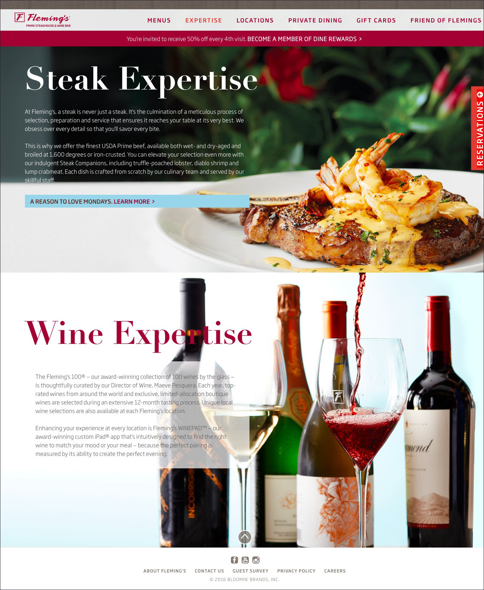

Menu
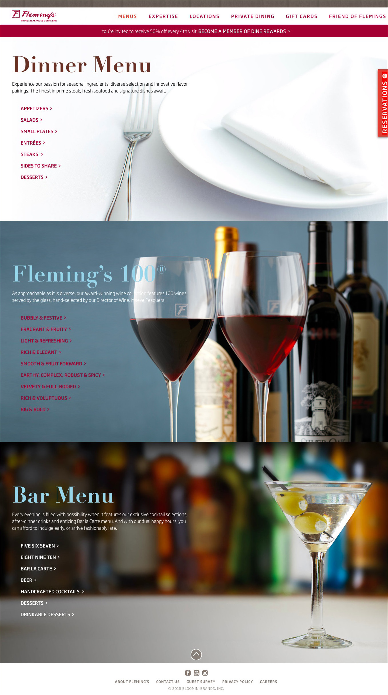

Advertisement
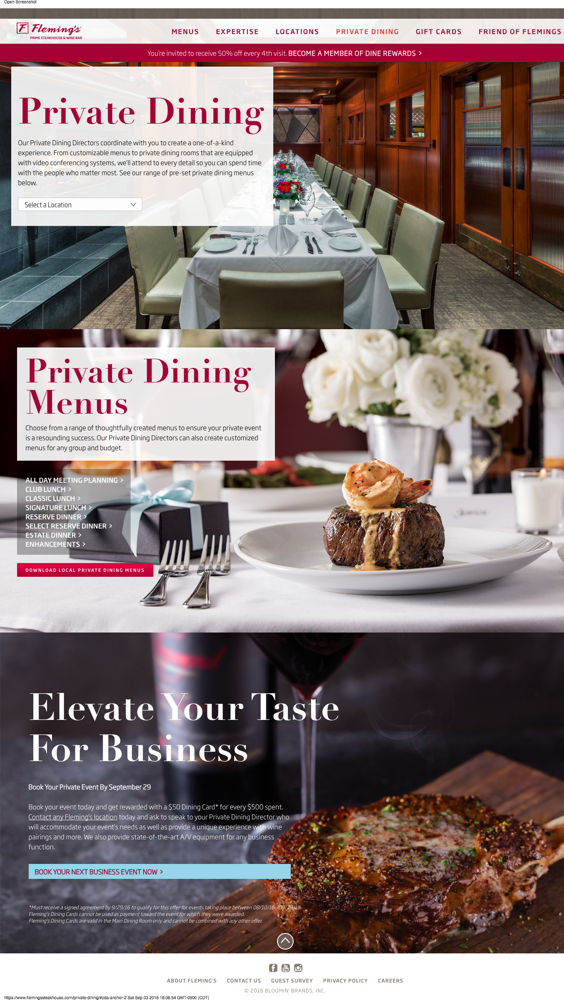

Advertisement
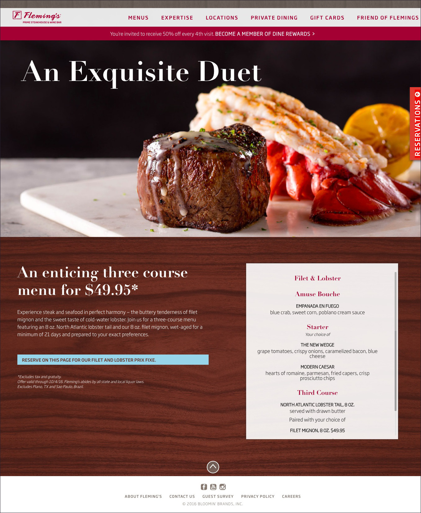

Advertisement

Dine Rewards
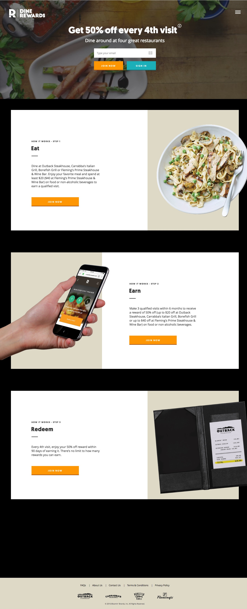

Gift Cards
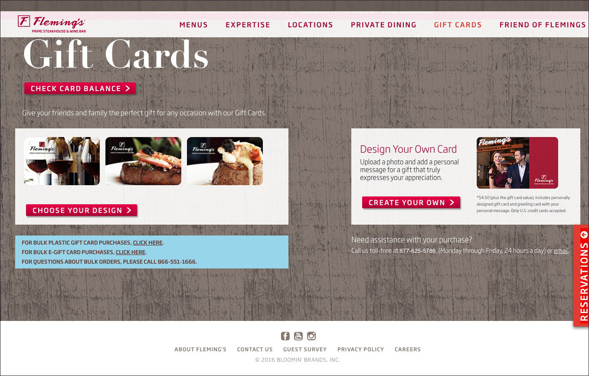

Friend of Fleming's
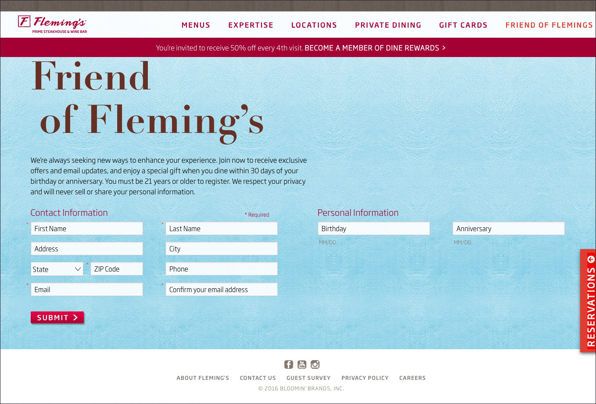

Guest Satisfaction Survey
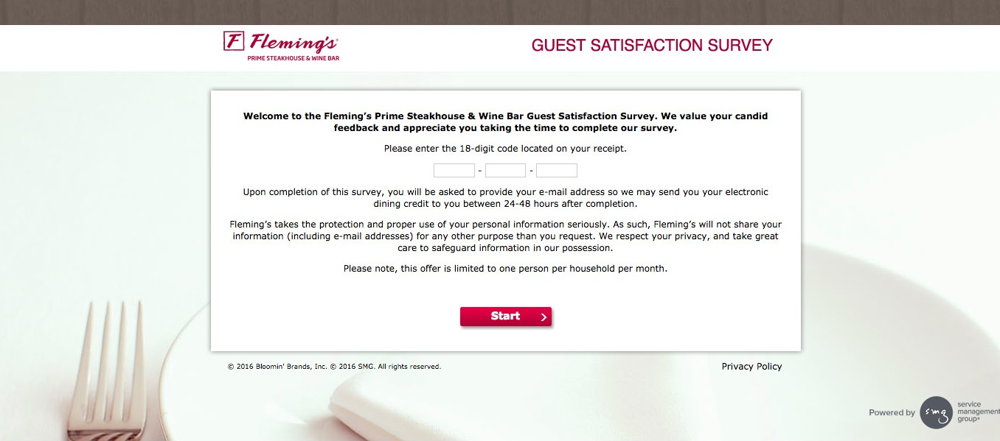

