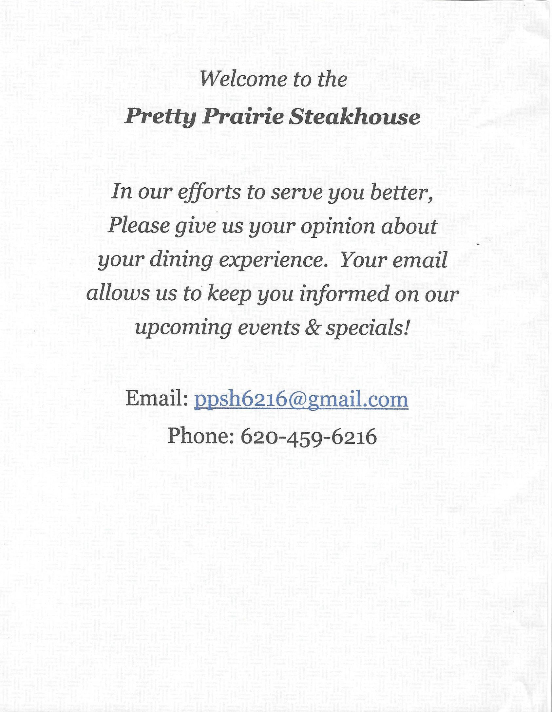

# Restaurant Menu

One of the dangers of typing the menu information directly into the website is that mistakes may be more likely to be made and information may become forgotten and out-of-date, especially if the information is listed in more than one place. On the other hand, an uploaded menu PDF may work well on a laptop/desktop, but less well on mobile, due to file size.

My recommendation to the client: 
* Provide a link to an up-to-date PDF of the scanned physical menu that users can look at and download
* Highlight signature dishes in a Signature detail page
* Perhaps, upload a PDF weekly of the specials document posted on the restaurant doors (can also be posted to Facebook)
* PDFs could be hosted through Google Docs with the shared link as a WordPress menu custom link

## Restaurant Menu Scans

